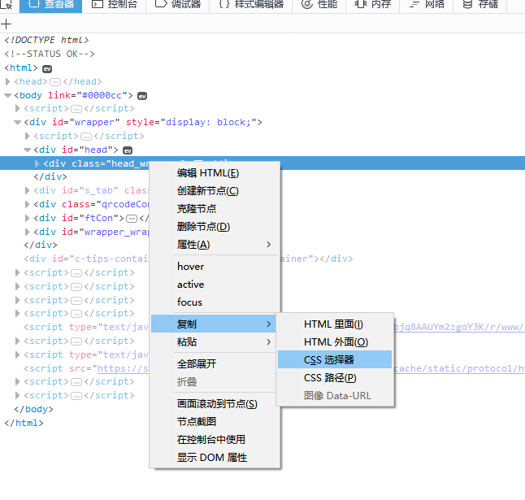

# 找不到工作的我，只好研究自动投递简历了

最近我找工作进度缓慢，有意向的公司屈指可数，看着朋友圈里面天天晒“我很忙”的 hr，感慨当拉勾论坛上可以扔出自己的简历，让有意向的公司找到自己，而现在各公司的招聘的描述大同小异，很难看出谁就是我要的。

因为我之前是研发自动化测试工具的，日站无数，为什么不研究自动投递简历呢？如果你正在看这篇文章，说明你和我一样找工作困难，希望这里的自动化的思想和脚本能帮到你。

在开始之前多唠叨一句，日站有一点非常关键，就是 CSS 选择器，如果你不熟悉，可以使用火狐的 “复制 css 选择器”功能。如图：

很多地方的参数都要填选择器，至于为什么那么填，大约要么是经验，要么我也是用工具选的。
（我知道 Chrome 也有这个功能，但是火狐的算法更好）

## 如何使用

克隆这个项目，或者直接下载代码。

对于所有的 JS 的脚本，你需要创建一个 .env 文件，然后在里面写上自己的拉勾或智联等网站的用户名和密码：
- lagou_name 拉勾用户名
- lagou_pass 拉勾密码
- lagou_key  拉勾职位关键字
- lagou_city 拉勾城市
- o100_name  100offer用户名
- o100_pass  100offer密码
- zhilian_name 智联用户名
- zhilian_pass 智联密码

再然后`yarn`拉依赖，就可以直接用 node 运行，比如 `node lagou` 就可以。
（部分用户需要根据情况调整 executablePath 选项，详见[说明](lagou/README.md)）

对于 Golang 代码，你需要安装 Golang，直接`go build`，然后运行生成的可执行文件就可以。